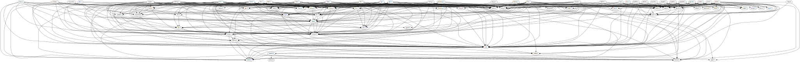
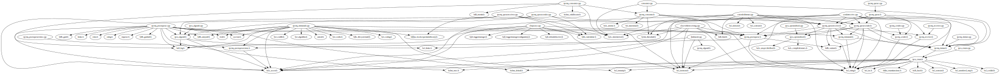

`graph-includes`
================
Print `#include` graph in graphviz format.

Why
---
Regular expressions are not enough, and clang is too much.

What
----
`graph-includes` is a `raco` command that, given a list of files and/or
directories, constructs a dependency graph from `#include` directives in the
source files, and prints the graph in graphviz (dot) format to standard output.

How
---
### Example Usage
```console
$ git clone https://github.com/lua/lua
$ raco graph-includes --exclude-std-c lua/ | dot -Tsvg -o lua.svg
$ firefox lua.svg &
```

### Install
```console
$ raco pkg install
```

You'll need an installation of [Racket][racket].  On Linux, it's best to use an
installer script from their [downloads page][download].  I like the "Minimal
Racket" flavor, because I don't use their IDE.

More
----
Here's an `svg` rendering of the output for [Lua's source code][lua] (might
want to "Open image in new tab"):


Here's a rendering of a [smaller project][ipc]:


[lua]: https://github.com/lua/lua
[ipc]: https://github.com/dgoffredo/ipc
[racket]: https://racket-lang.org/
[download]: https://download.racket-lang.org/releases/
